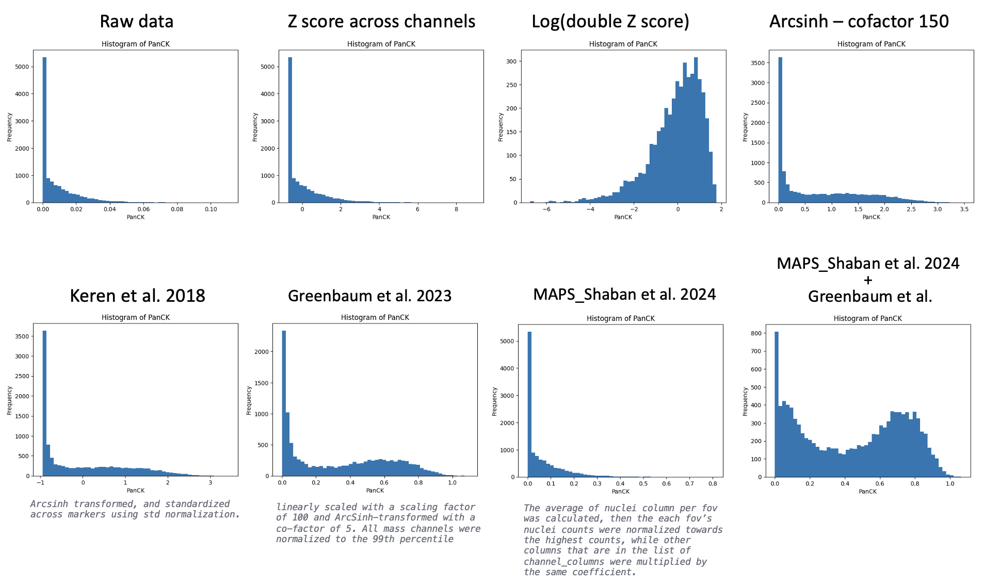

## norm_methods
A single repo of all available/potential tabular normalization methods for downstream analysis of spatial proteomics datasets

## The Importance of Normalization in Cell Type Classification for Highly Multiplexed Imaging
Normalization is a critical step in the process of cell type classification in highly multiplexed imaging, a technique that enables the simultaneous measurement of multiple biomarkers within a single tissue section. In this context, normalization refers to the process of adjusting the data to correct for various sources of technical variation that can obscure true biological differences. These variations can arise from differences in staining intensity, imaging conditions, and instrument calibration, which can significantly affect the accuracy and reliability of the results.

Highly multiplexed imaging generates complex and high-dimensional data, making it imperative to employ robust normalization techniques to ensure that the data is comparable across different samples and conditions. Proper normalization helps in mitigating batch effects and other artifacts that can lead to misclassification or inaccurate identification of cell types. By standardizing the data, normalization enhances the ability to distinguish subtle biological signals from noise, thereby improving the sensitivity and specificity of cell type classification.

Furthermore, normalization facilitates the integration and comparison of data from different experiments, which is essential for large-scale studies and meta-analyses. It enables researchers to draw more reliable and reproducible conclusions, ultimately advancing our understanding of cellular heterogeneity and the intricate mechanisms underlying various biological processes and diseases.

## Comparison of different methods via PanCK using MIBI data

## Methods and Resources
|Method|	Paper/Resource	|Platform	|Example Code|
|------|------------------|----------|------------|
|arcsinh transformation	| [Flow cytometry Paper](https://onlinelibrary.wiley.com/doi/10.1002/cyto.a.24491)  	[IMC Paper](https://onlinelibrary.wiley.com/doi/10.1002/cyto.a.24803)   [MIBI Paper](https://www.sciencedirect.com/science/article/pii/S0092867418311000?via%3Dihub)   [testing co-factors: Option 1](https://academic.oup.com/jrsssb/article-abstract/3/1/68/7026428?redirectedFrom=fulltext&login=true)|	CODEX, Flow cytometry, IMC, MIBI	| [Code](norm_methods.ipynb)|
|Centered log-ratio based normalization|		|CODEX, CITE-seq|	[Seurat code](https://satijalab.org/seurat/articles/seurat5_spatial_vignette_2)|
|manual background identification in MCD viewer|	[Paper](https://doi.org/10.1002/cyto.a.24480)|	IMC	||
|semi-automated background identification in ilastik|	[Paper](https://doi.org/10.1002/cyto.a.24480)	|IMC||	
|Z Normalization|	[Paper](https://www.frontiersin.org/journals/immunology/articles/10.3389/fimmu.2021.727626/full)	|CODEX	|[Code](norm_methods.ipynb)|
|log(double Z) normalization|	[Paper](https://www.frontiersin.org/journals/immunology/articles/10.3389/fimmu.2021.727626/full)	|CODEX	|[Code](norm_methods.ipynb)|
|min_max normalization|	[Paper](https://www.frontiersin.org/journals/immunology/articles/10.3389/fimmu.2021.727626/full)	|CODEX	||
|functional data analysis (FDA) or ComBAT (z-score based)	|[Paper](https://doi.org/10.1093/bioinformatics/btab877)	  	[mxnorm package](https://github.com/ColemanRHarris/mxnorm)|MxIF	|[mxnorm package](https://cran.r-project.org/web/packages/mxnorm/vignettes/mxnorm-vignette.html#methodology-background)|
|normalizing to a reference channel (example: nucleus)|	[Paper](https://doi.org/10.1038/s41467-023-44188-w)	|MIBI, CODEX	|[Code](norm_methods.ipynb)|

## Related Resources
**flow-cytometry based overview:** https://www.nature.com/articles/nri.2016.56

**scverse scRNA seq normalization overview:** https://www.sc-best-practices.org/preprocessing_visualization/normalization.html

**Computational solutions for spatial transcriptomics:** https://www.sciencedirect.com/science/article/pii/S2001037022003786

**IMC end to end workflow:** https://www.nature.com/articles/s41596-023-00881-0

-------------------------------------------------------------------------------------
Feel free to explore the provided resources and example codes to implement these normalization methods in your projects.

If you want to add more methods, please open an issue in this repository.
